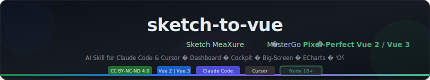
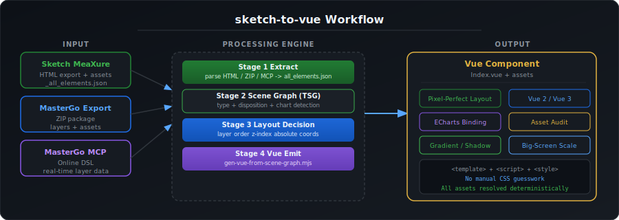
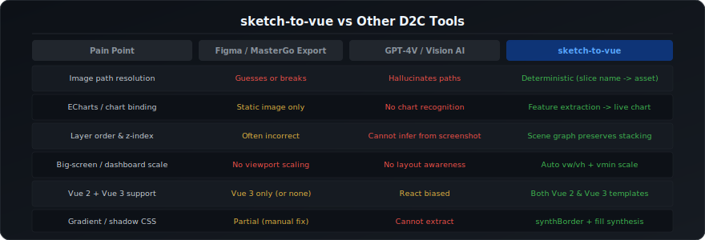

<div align="center">



[](LICENSE)
[](https://vuejs.org/)
[](https://react.dev/)
[](https://uniapp.dcloud.net.cn/)
[](https://claude.ai/code)
[](https://cursor.sh/)
[](https://nodejs.org/)
[](scripts/)
[](scripts/test-all.mjs)

**将 Sketch MeaXure / MasterGo 设计稿，转换为像素级对齐的前端页面——不猜测、不幻觉、图表可绑数据。**  
*The only AI Skill that converts design tool exports into truly runnable Vue / React / UniApp components.*

> Supports **Vue 2 · Vue 3 · React 18 · UniApp** — one skill, four framework targets.  
> MasterGo export packages and MasterGo MCP (online DSL) also supported.  
> Specialized for **Dashboard · Cockpit · Big-Screen · Mini Program** pages with ECharts integrations.

[**English**](#english-readme) · [**中文说明**](#中文说明完整版) · [安装](#安装) · [快速开始](#快速开始) · [脚本手册](#脚本手册) · [FAQ](#faq)

</div>

---

## 工作原理



---

## 与其他工具的对比



---

## 中文说明（完整版）

### 这是什么？

`sketch-to-vue` 是一套运行在 **Claude Code** 或 **Cursor** 中的 AI Skill（AI 助手技能包），专为解决"前端开发还原设计稿"这个经典难题——尤其是大屏、驾驶舱、数据看板类页面。

你只需要把设计工具的导出物（Sketch MeaXure 标注 HTML，或 MasterGo 导出包）给 AI，AI 会自动调用本 Skill 里的 30+ 个脚本，输出**可直接运行的组件**——支持 Vue 2 / Vue 3 / React 18 / UniApp 四种目标框架。

### 解决了什么痛点？

做过大屏页面还原的开发者都懂这些苦：

| 痛点 | 根本原因 | sketch-to-vue 的解法 |
|---|---|---|
| 图片全是 404 | 路径靠猜，文件名不匹配 | 从 `objectID` + `exportable.path` 确定性解析，零猜测 |
| 图表变成截图/色块 | 工具不理解"这是一个柱状图" | Scene Graph 识别图表特征区域，自动生成可绑数据的 ECharts 组件 |
| 图层顺序全乱 | 200+ 图层，z-order 无法人工维护 | 有向无环图（DAG）精确还原任意嵌套深度的层叠顺序 |
| 大屏缩放/宿主嵌入踩坑 | 全屏驾驶舱 vs 嵌入侧边栏，逻辑完全不同 | 宿主布局决策脚本 + letterbox/CONTENT_SHIFT 精确公式 |
| 字体颜色边框丢失 | 标注导出丢弃了部分 CSS 信息 | 全量 CSS 提取 + 渐变边框合成 + 椭圆/阴影自动处理 |
| AI 自由发挥乱加内容 | LLM 有幻觉倾向 | 4 条铁律 + 消费侧审计门禁，每个元素都有原始数据支撑 |

### 支持哪些输出框架？

| target 参数 | 输出产物 | 适用场景 |
|---|---|---|
| `vue2`（默认） | `Index.vue`（Options API）+ scoped CSS | Vue 2 PC 中后台、大屏驾驶舱 |
| `vue3` | `Index.vue`（Composition API）+ ECharts composable | Vue 3 新项目 |
| `react` | `Index.jsx` + `index.module.css` + `chartOptions.js` | React 18 PC / C端 |
| `uniapp` | `index.vue`（UniApp 规范）+ `pages.json.snippet` | H5 / 微信小程序 / App 三端 |

> **告诉 AI 目标框架**：`转成 React`、`生成 UniApp 版本`、`target: uniapp`……  
> AI 自动路由到对应 emitter，核心提取与场景图阶段完全复用，只有出码层切换。

### 支持哪些设计工具？

| 轨道 | 输入格式 | 适用场景 |
|---|---|---|
| **A · Sketch MeaXure** | `index.html` + `assets/`（标注导出）| 使用 MeaXure 插件导出的 Sketch 标注稿 |
| **B · MasterGo 导出包** | `FILE_DATA.json` + `data/exports/`（离线导出）| MasterGo 右键"导出"的离线包 |
| **C · MasterGo MCP** | `mastergo.com` 链接 / fileId | 需要实时读取 DSL，需要 MasterGo Token |

### 安装

> **前置要求**：Node.js 18+，Python 3.9+（仅 C 轨道），Claude Code 或 Cursor

```bash
# Claude Code 全局安装
git clone https://github.com/chenboxun87/sketch-to-vue.git ~/.claude/skills/sketch-to-vue

# Cursor 全局安装（Windows，创建 Junction 指向同一目录）
New-Item -ItemType Junction -Path "$env:USERPROFILE\.cursor\skills\sketch-to-vue" `
  -Target "$env:USERPROFILE\.claude\skills\sketch-to-vue"

# 安装脚本依赖（Node.js）
cd ~/.claude/skills/sketch-to-vue/scripts && npm install
```

自定义路径：
```bash
git clone https://github.com/chenboxun87/sketch-to-vue.git /自定义路径
export DESIGN_TO_VUE_SKILL_ROOT=/自定义路径
```

> 详细安装与双端同步说明 → [`sync/INSTALL.md`](sync/INSTALL.md)

### 快速开始

#### 在 Cursor 中

1. 打开 Cursor → 新建 Agent 对话
2. 输入任意触发词：`切图`、`MeaXure`、`MasterGo`、`大屏还原`、`驾驶舱`、`sketch-to-vue`、`设计稿转Vue`
3. AI 自动加载 Skill，按提示填写「**项目变量映射表**」（设计稿路径、Vue 版本、路由路径等）

#### 在 Claude Code 中

```bash
# 在你的 Vue 项目根目录
/use-skill sketch-to-vue

# 或直接描述需求
# 示例："把 D:/docs/myDesign 目录里的 MeaXure 标注导出物转成 Vue3 大屏驾驶舱页面"
```

### A 轨道标准流程（Sketch MeaXure）

```
设计目录结构：
your-design/
├── index.html       ← 含 "let data = {" 的图层标注数据
├── assets/          ← 切图 PNG/SVG
└── preview/         ← （可选）预览图
```

```bash
# Step 1：全量提取（产出 scene-graph、图层栈、字体清单等）
node scripts/extract-all-elements.mjs  index.html  assets/  ./out

# Step 2：宿主布局决策（大屏必做，写 Index.vue 前）
node scripts/decide-host-layout.mjs  ./out  --arch layerStack

# Step 3：告诉 AI 基于 ./out 生成 Vue 组件，AI 自动执行后续步骤

# Step 4（交付前）：资产消费自检
node scripts/audit-asset-consumption.mjs  --scene ./out/scene-graph.json  --assets assets/

# Step 5（交付前）：渲染计划门禁
node scripts/verify-board-render-plan.mjs  ./out
```

### 核心能力详解

#### 1. 确定性资产解析
所有图片路径均来自 MeaXure 标注数据中的 `objectID` + `exportable.path`，**不靠文件大小、颜色、人眼猜测**。哪怕设计师命名文件很随意，也能准确定位到正确图片。

#### 2. Scene Graph（有向图）
不同于简单的图层列表，Scene Graph 是一个**有向无环图（DAG）**，记录了：
- 父子嵌套关系（哪些图层是同一个"组"里的）
- 语义边（哪些图层组合在一起构成一个"图表"或"KPI 卡片"）
- Disposition 分类（每个节点应该被渲染为切片/向量/ECharts/纯文本/排除）

无论图层嵌套多深，都能被精确挖出并正确分类。

#### 3. ECharts 自动识别
通过分析图层的空间关系、颜色渐变规律、尺寸分布，自动识别：
- 柱状图（均等矩形阵列）
- 折线图区域
- 饼图 / 环形图
- 雷达图
并生成**可绑 mock 数据的 ECharts 配置**，而不是截图。

#### 4. 消费侧全量审计
`audit-asset-consumption.mjs` 在交付前扫描六类问题：
- `missing-asset`：404 缺失图片
- `shared-file`：命名碰撞
- `aspect-distort`：图片拉伸（并给出 `object-fit` 修复建议）
- `empty-vector`：空盒子
- `text-fragment-overlap`：文字双渲染
- `unused-asset`：冗余未使用资产

#### 5. 大屏布局四模式
针对大屏/驾驶舱特有的布局挑战，提供四种经过验证的缩放策略：
- 宽度铺满 + 纵向滚动
- Letterbox 整页适配（等比缩放，上下留黑边）
- 嵌入 BasicLayout（计算 CONTENT_SHIFT）
- 全屏独立路由

### 目录结构

```
sketch-to-vue/
├── SKILL.md                    ← AI 主入口（Cursor/Claude Code 自动加载）
├── SECURITY.md                 ← 安全说明（网络边界 / Token 处理）
├── scripts/                    ← 30+ 脚本
│   ├── extract-all-elements.mjs   全量元素提取 + Scene Graph
│   ├── extract-chart-features.mjs ECharts 图表区域识别
│   ├── audit-asset-consumption.mjs 消费侧六类问题审计
│   ├── gen-vue-from-scene-graph.mjs 确定性 Vue 代码生成
│   ├── decide-host-layout.mjs  宿主布局决策门禁
│   ├── verify-board-render-plan.mjs 交付前渲染计划门禁
│   └── test-all.mjs            全量回归测试入口
├── references/                 ← 24 份分阶段规则文档（约 8000 行）
│   ├── reading-guide.md        阶段导航（每阶段必读文件 + 行号）
│   ├── hard-won-rules.md       55+ 条踩坑规则（大屏必读）
│   ├── meaxure-track.md        A 轨道完整流程
│   └── ...
├── templates/                  ← Vue / ECharts 可复用模板
│   ├── vue/                    MeaXure 全屏页面模板
│   ├── echarts/                图表主题 + 系列配置模板
│   └── shared/                 boardRender / textStyle / vectorStyle
├── docs/images/                ← 本 README 使用的图示
└── sync/                       ← 双端同步脚本（Claude ↔ Cursor）
```

### 常见问题

**Q：不需要 MasterGo 账号也能用吗？**  
A：A 轨道和 B 轨道完全离线，只需要设计导出文件。C 轨道需要 MasterGo Token。

**Q：Vue 2 还是 Vue 3？**  
A：自动从 `package.json` 检测。也可以直接告诉 AI "用 Vue 3"。

**Q：支持 Figma 吗？**  
A：暂不支持，Figma 导出格式不同。Track D（Figma）在 Roadmap 中。

**Q：公司内部商业项目能用吗？**  
A：内部非商业使用 + 署名即可。不可对外销售/收费。详见 [LICENSE](LICENSE)。

**Q：AI 跳过了一些图层，为什么？**  
A：先跑 `audit-asset-consumption.mjs`，它会列出每个被过滤/排除元素的具体原因（图表区内/幽灵图层/重复等）。

---

## English README

### What is sketch-to-vue?

**sketch-to-vue** is an AI Skill for Claude Code & Cursor that converts Sketch MeaXure annotation exports (and MasterGo packages) into pixel-perfect Vue 2/3 components — deterministically, with no visual guessing.

**Best for:** Dashboard · Cockpit · Big-Screen pages with complex layering, ECharts integrations, and strict pixel-alignment requirements.

### Install

```bash
git clone https://github.com/chenboxun87/sketch-to-vue.git ~/.claude/skills/sketch-to-vue
cd ~/.claude/skills/sketch-to-vue/scripts && npm install
```

Custom path: `export DESIGN_TO_VUE_SKILL_ROOT=/any/path`

### Quick Start

Trigger in Cursor or Claude Code with: `MeaXure` · `Sketch` · `MasterGo` · `big-screen` · `cockpit` · `sketch-to-vue`

### 3 Input Tracks

<details>
<summary><b>Track A · Sketch MeaXure</b></summary>

```bash
node scripts/extract-all-elements.mjs  index.html  assets/  ./out
node scripts/decide-host-layout.mjs    ./out  --arch layerStack
# Then tell AI: "Generate Vue component from ./out"
```
</details>

<details>
<summary><b>Track B · MasterGo Export Package</b></summary>

```bash
node scripts/extract-mastergo-all.mjs \
  --dir "./export" --design-root "./" --frame "MainFrame" --out "./pilot/data"
```
</details>

<details>
<summary><b>Track C · MasterGo MCP (online)</b></summary>

```bash
export MASTERGO_TOKEN=your_token_here
python scripts/mastergo_get_dsl.py --file-id "abc123" --layer-id "xyz456"
```
</details>

### Key Scripts

| Script | Purpose |
|---|---|
| `extract-all-elements.mjs` | Full element extraction + Scene Graph DAG |
| `extract-chart-features.mjs` | Auto-detect ECharts zones |
| `audit-asset-consumption.mjs` | 6-type consumption audit (missing/wrong/duplicate) |
| `gen-vue-from-scene-graph.mjs` | Deterministic Vue codegen from scene graph |
| `decide-host-layout.mjs` | Host layout decision gate |
| `verify-board-render-plan.mjs` | Pre-delivery render plan gate |
| `test-all.mjs` | Full regression suite (~30s) |

### Roadmap

- [ ] Track D: Figma export support
- [ ] Auto-generate ECharts mock data from design annotations
- [ ] VS Code extension
- [ ] Web UI for designers

### Contributing

```bash
cd scripts && node test-all.mjs   # must all pass before PR
```

---

## 脚本手册

<details>
<summary><b>A 轨道 — 完整命令列表</b></summary>

```bash
# 数据提取
node scripts/extract-meaxure.mjs          index.html layers.json
node scripts/extract-all-elements.mjs     index.html assetsDir outDir
python scripts/extract-meaxure-data.py    index.html [artboardIndex]

# 多画板
node scripts/merge-artboards.mjs          <dataDir>
node scripts/measure-artboard-coverage.mjs <dataDir> [W] [H]
node scripts/detect-artboard-merge.mjs    <dataDir>

# 图表识别
node scripts/extract-chart-features.mjs  <dataDir> <panels.json>

# 场景图
node scripts/audit-scene-graph.mjs       <outDir>/scene-graph.json
node scripts/gen-vue-from-scene-graph.mjs <outDir>/scene-graph.json <zones> <outDir>

# 资产审计（交付前必跑）
node scripts/audit-asset-consumption.mjs \
  --scene <outDir>/scene-graph.json --assets <assetsDir>

# 渲染计划门禁
node scripts/verify-board-render-plan.mjs <outDir>

# KPI 活体覆盖层
node scripts/gen-kpi-overlays.mjs \
  --elements <outDir>/_all_elements.json \
  --board board@2x.png --out kpiOverlays.json

# 静态 HTML 基线
node scripts/emit-html.mjs  layers.json  assetsDir  outDir

# 锚区计算
node scripts/meaxure-anchor-regions.mjs \
  --html index.html --rules anchorMeasureRules.json --out anchorRegions.json

# 字体审计
node scripts/audit-project-fonts.mjs  <outDir>

# 对称 KPI 漏导检测
node scripts/detect-symmetric-module-gaps.mjs <outDir>/_all_elements.json
```
</details>

<details>
<summary><b>B 轨道 — 完整命令列表</b></summary>

```bash
node scripts/extract-mastergo-all.mjs \
  --dir "<export>" --design-root "./" --frame "<frame>" --out "<pilot>/data"
node scripts/extract-mastergo-css.mjs \
  --dir "<export>" --frame "<frame>" [--vue] [--out file.json]
node scripts/emit-mastergo-html.mjs \
  "<pilot>/data" "<export>/data/exports" "<pilot>/emit-baseline"
node scripts/verify-mg-g9.mjs  "<pilot>/emit-baseline"  "<pilot>/data"
```
</details>

<details>
<summary><b>C 轨道 — 完整命令列表</b></summary>

```bash
python scripts/mastergo_analyze.py    "https://mastergo.com/goto/xxx"
python scripts/mastergo_get_dsl.py    --file-id "<id>" --layer-id "<id>"
python scripts/mastergo_fetch_docs.py --from-dsl
node   scripts/fetch-mg-dsl.mjs       --file-id "<id>" --layer-id "<id>" --out path.json
```
</details>

<details>
<summary><b>回归测试</b></summary>

```bash
cd scripts && node test-all.mjs   # 全部通过才可提交
```
</details>

---


---

## 同一个设计稿 · 三种框架输出对比

> 以一个 KPI 数字卡片为例，展示 sketch-to-vue 对不同目标框架的输出效果。

### 输入：Scene Graph 片段

```json
{
  "id": "kpi-001",
  "kind": "live-text-static",
  "name": "今日用电量",
  "attrs": {
    "content": "12,345",
    "fontSize": 36,
    "fontWeight": "bold",
    "color": "#FFFFFF",
    "left": 40, "top": 80, "width": 200, "height": 50
  }
}
```

---

### Vue 2 / Vue 3 输出

```vue
<template>
  <div class="kpi-001" style="position:absolute;left:40px;top:80px;width:200px;height:50px;">
    <span class="kpi-label">今日用电量</span>
    <span class="kpi-value">12,345</span>
  </div>
</template>

<style scoped>
.kpi-001 { display: flex; flex-direction: column; }
.kpi-value { font-size: 36px; font-weight: bold; color: #FFFFFF; }
</style>
```

---

### React 18 输出（JSX + CSS Modules）

```jsx
// KpiCard.jsx
import styles from './KpiCard.module.css'

export default function KpiCard() {
  return (
    <div className={styles.kpi001}>
      <div style={{fontSize:'36px',fontWeight:'bold',color:'#FFFFFF'}}>
        {"12,345"}
      </div>
    </div>
  )
}
```

```css
/* KpiCard.module.css */
.kpi001 {
  position: absolute;
  left: 40px; top: 80px;
  width: 200px; height: 50px;
}
```

---

### UniApp 输出（H5 + 微信小程序双端）

```vue
<template>
  <view class="kpi001">
    <text class="kpi-value">{{ kpiValue }}</text>
  </view>
</template>

<script>
export default {
  data() {
    return { kpiValue: '12,345' }   // TODO: 替换为真实 API 数据
  }
}
</script>

<style>
.kpi001 { position: absolute; left: 80rpx; top: 160rpx; width: 400rpx; height: 100rpx; }
.kpi-value { font-size: 72rpx; font-weight: bold; color: #FFFFFF; }
</style>
```

> UniApp 自动将 `px` 换算为 `rpx`（750rpx 基准），一份代码跑 H5 / 微信小程序 / App。

---
## FAQ

**Q: 不用 MasterGo / 只用 Sketch，可以吗？**  
A: 完全可以，A 轨道（Sketch MeaXure）是最完整的轨道，离线运行，无任何账号要求。

**Q: 支持 Vue 2 和 Vue 3 两个版本？**  
A: 是的，自动从 `package.json` 检测。两个版本有各自独立的模板集。显式指定则说"用 Vue 3"即可。

**Q: 大屏页面不同分辨率怎么处理？**  
A: 内置四种缩放模式（letterbox/铺满/嵌入/全屏），`decide-host-layout.mjs` 自动给出推荐方案。

**Q: 能处理 200 层以上的复杂设计稿吗？**  
A: 可以，这正是 Scene Graph 存在的意义。已验证处理过 300+ 图层的驾驶舱页面。

**Q: 图表部分还需要手动写 ECharts 吗？**  
A: 大部分情况 AI 会自动生成带 mock 数据的 ECharts 配置，你只需要替换成真实 API 数据。

---

## License

Copyright (c) 2026 **[chenboxun87](https://github.com/chenboxun87)**  
Licensed under [CC BY-NC-ND 4.0](LICENSE) — 详见 [LICENSE](LICENSE) 文件

✅ 个人学习 & 非商业项目免费使用（需署名）  
❌ 禁止商业用途 · 禁止发布衍生版本 · 禁止去署名冒名转发

---

<div align="center">

**如果这个项目对你有帮助，欢迎点 ⭐ Star 支持！**  
Star 是对作者最直接的鼓励，也帮助更多开发者发现这个工具。

[⭐ 点击 Star](https://github.com/chenboxun87/sketch-to-vue) · [🐛 提 Issue](https://github.com/chenboxun87/sketch-to-vue/issues) · [💡 功能建议](https://github.com/chenboxun87/sketch-to-vue/issues/new)

</div>
